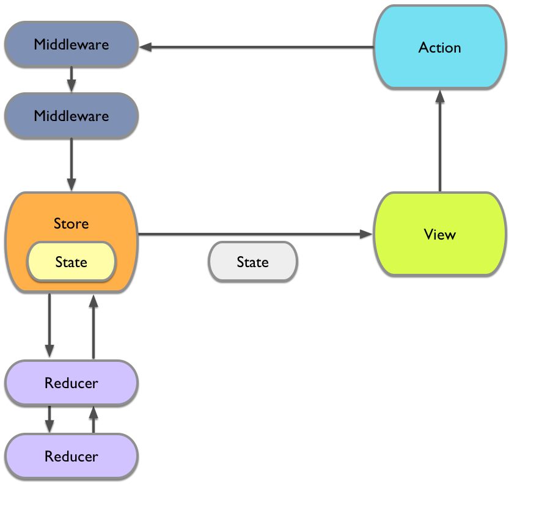

# ReactiveReSwift

[](https://travis-ci.org/ReSwift/ReactiveReSwift)
[](http://codecov.io/github/ReSwift/ReactiveReSwift)
[](https://github.com/ReSwift/ReactiveReSwift/blob/master/LICENSE.md)
[](https://gitter.im/ReactiveReSwift/Lobby?utm_source=badge&utm_medium=badge&utm_campaign=pr-badge&utm_content=badge)

ReactiveReSwift is a [Redux](https://github.com/reactjs/redux)-like implementation of the unidirectional data flow architecture in Swift, derived from [ReSwift](https://github.com/ReSwift/ReSwift). ReactiveReSwift helps you to separate three important concerns of your app's components:

- **State**: in a ReactiveReSwift app the entire app state is explicitly stored in a data structure. This helps avoid complicated state management code, enables better debugging and has many, many more benefits...
- **Views**: in a ReactiveReSwift app your views update when your state changes. Your views become simple visualizations of the current app state.
- **State Changes**: in a ReactiveReSwift app you can only perform state changes through actions. Actions are small pieces of data that describe a state change. By drastically limiting the way state can be mutated, your app becomes easier to understand and it gets easier to work with many collaborators.

The ReactiveReSwift library is tiny - allowing users to dive into the code, understand every single line and [hopefully contribute](#contributing).

Check out our [public gitter chat!](https://gitter.im/ReactiveReSwift/Lobby)

# Table of Contents

- [About ReactiveReSwift](#about-reactivereswift)
- [Why ReactiveReSwift?](#why-reactivereswift)
- [Getting Started Guide](#getting-started-guide)
- [Installation](#installation)
- [Reactive Extensions](#reactive-extensions)
- [Example Projects](#example-projects)
- [Contributing](#contributing)
- [Credits](#credits)
- [Get in touch](#get-in-touch)

# About ReactiveReSwift

ReactiveReSwift relies on a few principles:
- **The Store** stores your entire app state in the form of a single data structure. This state can only be modified by dispatching Actions to the store. Whenever the state in the store changes, the store will notify all observers.
- **Actions** are a declarative way of describing a state change. Actions don't contain any code, they are consumed by the store and forwarded to reducers. Reducers will handle the actions by implementing a different state change for each action.
- **Reducers** provide pure functions, that based on the current action and the current app state, create a new app state



For a very simple app, one that maintains a counter that can be increased and decreased, you can define the app state as following:

```swift
struct AppState {
  let counter: Int
}
```

You would also define two actions, one for increasing and one for decreasing the counter. For the simple actions in this example we can use an enum that conforms to action:

```swift
enum AppAction: Action {
    case increase
    case decrease
}
```

Your reducer needs to respond to these different actions, that can be done by switching over the value of action:

```swift
let appReducer: Reducer<AppState> = { action, state in
    switch action as? AppAction {
    case .increase?:
        return AppState(counter: state.counter + 1)
    case .decrease?:
        return AppState(counter: state.counter - 1)
    default:
        return state
    }
}
```

A single `Reducer` should only deal with a single field of the state struct. You can nest multiple reducers within your main reducer to provide separation of concerns.

In order to have a predictable app state, it is important that the reducer is always free of side effects, it receives the current app state and an action and returns the new app state.

To maintain our state and delegate the actions to the reducers, we need a store. Let's call it `mainStore` and define it as a global constant, for example in the app delegate file:

```swift
let initialState = AppState(counter: 0)

let mainStore = Store(
  reducer: appReducer,
  observable: ObservableProperty(initialState)
)

@UIApplicationMain
class AppDelegate: UIResponder, UIApplicationDelegate {
	[...]
}
```


Lastly, your view layer, in this case a view controller, needs to tie into this system by subscribing to store updates and emitting actions whenever the app state needs to be changed:

```swift
class CounterViewController: UIViewController {

  private let disposeBag = SubscriptionReferenceBag()
  @IBOutlet var counterLabel: UILabel!

  override func viewDidLoad() {
    disposeBag += mainStore.observable.subscribe { [weak self] state in
      self?.counterLabel.text = "\(state.counter)"
    }
  }

  @IBAction func increaseButtonTapped(sender: UIButton) {
    mainStore.dispatch(
      AppAction.increase
    )
  }

  @IBAction func decreaseButtonTapped(sender: UIButton) {
    mainStore.dispatch(
      AppAction.decrease
    )
  }

}
```

The `mainStore.observable.subscribe` block will be called by the `ObservableStore` whenever a new app state is available, this is where we need to adjust our view to reflect the latest app state.

Button taps result in dispatched actions that will be handled by the store and its reducers, resulting in a new app state.

This is a very basic example that only shows a subset of ReactiveReSwift's features, read the Getting Started Guide to see how you can build entire apps with this architecture. For a complete implementation of this example see the [ReactiveCounterExample](https://github.com/Qata/ReactiveCounterExample) project.

[You can also watch this talk on the motivation behind ReSwift](https://realm.io/news/benji-encz-unidirectional-data-flow-swift/).

# Reactive Extensions

Here are some examples of what your code would look like if you were to leverage certain FRP libraries when writing your application.

- [Documentation for ReactiveSwift](https://github.com/ReSwift/ReactiveReSwift/tree/master/Docs/Reactive/ReactiveSwift.md)
- [Documentation for ReactiveKit](https://github.com/ReSwift/ReactiveReSwift/tree/master/Docs/Reactive/ReactiveKit.md)
- [Documentation for PromiseKit](https://github.com/ReSwift/ReactiveReSwift/tree/master/Docs/Reactive/PromiseKit.md)
- [Documentation for RxSwift](https://github.com/ReSwift/ReactiveReSwift/tree/master/Docs/Reactive/RxSwift.md)
- [Documentation for CwlSignal](https://github.com/ReSwift/ReactiveReSwift/tree/master/Docs/Reactive/CwlSignal.md)

# Why ReactiveReSwift?

Model-View-Controller (MVC) is not a holistic application architecture. Typical Cocoa apps defer a lot of complexity to controllers since MVC doesn't offer other solutions for state management, one of the most complex issues in app development.

Apps built upon MVC often end up with a lot of complexity around state management and propagation. We need to use callbacks, delegations, Key-Value-Observation and notifications to pass information around in our apps and to ensure that all the relevant views have the latest state.

This approach involves a lot of manual steps and is thus error prone and doesn't scale well in complex code bases.

It also leads to code that is difficult to understand at a glance, since dependencies can be hidden deep inside of view controllers. Lastly, you mostly end up with inconsistent code, where each developer uses the state propagation procedure they personally prefer. You can circumvent this issue by style guides and code reviews but you cannot automatically verify the adherence to these guidelines.

ReactiveReSwift attempts to solve these problem by placing strong constraints on the way applications can be written. This reduces the room for programmer error and leads to applications that can be easily understood - by inspecting the application state data structure, the actions and the reducers.

## Why "Reactive"?

A common design pattern with Redux and its derivates is to observe your store using functional reactive programming (FRP), which the user takes care of using very similar looking boilerplate, regardless of the FRP library they've chosen.

Instead of pushing that onto the user, and to encourage people to use FRP, ReactiveReSwift provides protocols to conform to so that the underlying `Store` can directly use the observables from your preferred library without subclassing.

ReactiveReSwift also comes with an extremely simple implementation of a functional reactive observable. This `ObservableProperty` type allows you to use ReactiveReSwift without any other FRP libraries and not lose any of the functionality provided by ReSwift. That said, we do still highly encourage you to use a functional reactive library with ReactiveReSwift.

# Getting Started Guide

[The documentation for ReactiveReSwift can be found here](http://reswift.github.io/ReactiveReSwift/master/getting-started-guide.html). To get an understanding of the core principles we recommend reading the brilliant [redux documentation](http://redux.js.org/).

# Installation

## Carthage

You can install ReactiveReSwift via [Carthage](https://github.com/Carthage/Carthage) by adding the following line to your `Cartfile`:

```
github "ReSwift/ReactiveReSwift"
```

## Swift Package Manager

You can install ReactiveReSwift via [Swift Package Manager](https://swift.org/package-manager/) by adding the following line to your `Package.swift`:

```
import PackageDescription

let package = Package(
    [...]
    dependencies: [
        .Package(url: "https://github.com/ReSwift/ReactiveReSwift.git", majorVersion: XYZ)
    ]
)
```

# Roadmap

## Swift 4

- Change serialisation to use `Codable` and `Decodable` protocols provided by Swift 4.

# Example Projects

- [Counter Example](https://github.com/Qata/ReactiveCounterExample): A very simple counter app implemented with ReactiveReSwift.
- [ReactiveSwift Counter Example](https://github.com/Qata/ReactiveReSwift-ReactiveSwiftExample): A counter example that interfaces with ReactiveSwift.
- [ReactiveKit Counter Example](https://github.com/Qata/ReactiveReSwift-ReactiveKitExample): A counter example that interfaces with ReactiveKit.
- [PromiseKit Counter Example](https://github.com/Qata/ReactiveReSwift-PromiseKitExample): A counter example that interfaces with PromiseKit.
- [RxSwift Counter Example](https://github.com/Qata/ReactiveReSwift-RxSwiftExample): A counter example that interfaces with RxSwift.
- [CwlSignal Counter Example](https://github.com/Qata/ReactiveReSwift-CwlSignalExample): A counter example that interfaces with CwlSignal.

# Contributing

There's still a lot of work to do here! We would love to see you involved! You can find all the details on how to get started in the [Contributing Guide](/CONTRIBUTING.md).

# Credits

- Huge thanks to [Evan Czaplicki](https://github.com/evancz) for creating [Elm](https://github.com/elm-lang), the first language to implement unidirectional data flow as a paradigm.
- Thanks a lot to [Dan Abramov](https://github.com/gaearon) for building [Redux](https://github.com/reactjs/redux), many ideas in here were provided by his library.
- Thanks a lot to [Benjamin Encz](https://github.com/Ben-G) for building [ReSwift](https://github.com/ReSwift/ReSwift), the base from which this project was derived.

# Get in touch

If you have any questions, you can find the core team on twitter:

- [@chartortorella](https://twitter.com/chartortorella)

We also have a [public gitter chat!](https://gitter.im/ReactiveReSwift/Lobby)
